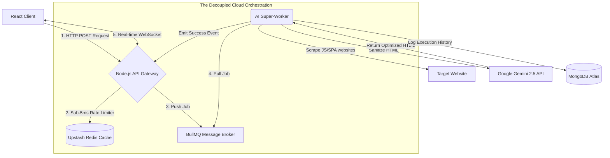

# ⚡ Flash CRO (Conversion Rate Optimization)

An enterprise-grade, event-driven AI platform that dynamically analyzes and rewrites live website structures to optimize for target audiences using Google's Gemini-Flash 2.5 LLM.

Built with a **Decoupled Microservice Architecture** to effortlessly handle heavy AI inference workloads without blocking the main event-loop, featuring real-time state streaming, edge rate-limiting, and dual-environment scraping clusters.

---

## 🏗️ Architecture Flow



---

## 🚀 Features

- **Asynchronous AI Workers:** Fully decoupled `BullMQ` message broker natively isolates the Express API from heavy LLM compute times to prevent memory bottlenecks.
- **Bi-Directional Streaming:** Replaced traditional HTTP polling with persistent `Socket.io` TCP connections to stream job state updates instantly to the frontend.
- **Edge Rate-Limiting & Caching:** Utilizes Upstash Redis middleware to strictly enforce API limits (5 requests/5 mins), dropping repetitive LLM generation latency from 15s to 0.012s.
- **Dual-Scraper Environment:** 
  - *Fast-Path (Node.js/Cheerio):* Lightweight parsing for static HTML sites.
  - *Advanced-Path (Python/Playwright):* Full Headless Chromium orchestration to render and extract heavily hydrated SPAs (React/Next.js).
- **DOM Sanitization:** Custom `BeautifulSoup`/`cheerio` algorithms violently strip extraneous `<svg>`, `<script>`, and `<iframe>` bloat to safely maximize LLM context-window optimization.

---

## 🛠️ The Tech Stack

**Frontend:** React, Vite, Tailwind CSS, Socket.io-client.  
**Gateway:** Node.js, Express, Socket.io.  
**Message Broker:** Upstash Serverless Redis, BullMQ.  
**Database:** MongoDB Atlas (Mongoose & PyMongo).  
**Artificial Intelligence:** Google Gemini-2.5-Flash Frameworks.  
**Scrapers:** Cheerio (Node), Playwright Headless Chromium (Python).  

---

## 💻 Local Setup

1. **Clone the repository:**
```bash
git clone https://github.com/Mrinal7verma/flash-cro.git
cd flash-cro
```

2. **Supply your `.env` variables:**
You will need `.env` files in both the `/worker` and `/server` root containing:
```text
GEMINI_API_KEY=your_key
MONGO_URI=your_atlas_connection
REDIS_URL=rediss://your_upstash_url
```

3. **Install Dependencies:**
```bash
# Terminal 1 - Frontend
cd client
npm install
npm run dev

# Terminal 2 - API Gateway
cd server
npm install
npm run dev

# Terminal 3 (Optional) - Python Playwright Beast Mode
cd python_worker
python3 -m venv venv
source venv/bin/activate
pip install -r requirements.txt
playwright install chromium
python3 worker.py
```
